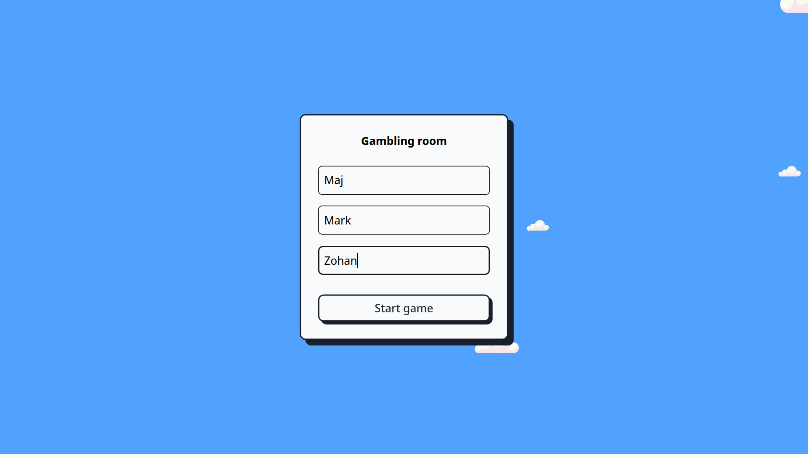
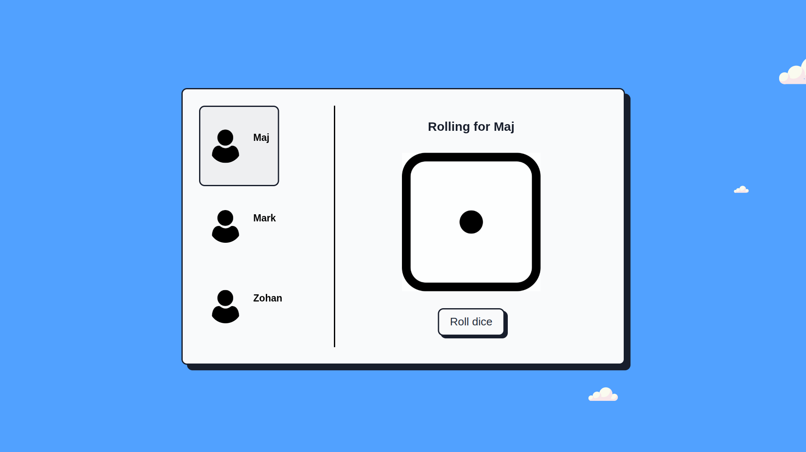
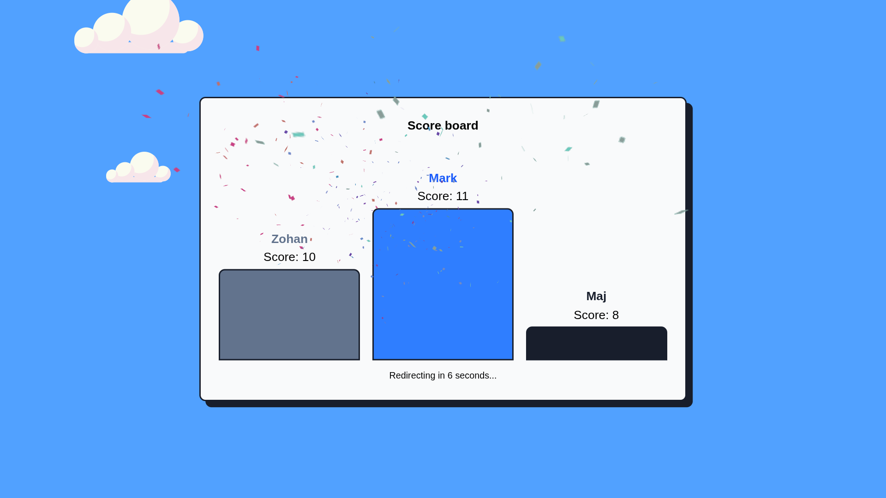

<h1 align="center">Gambling Room</h1>

<p align="left">
A browser-based dice rolling game for three players, built with PHP sessions, Tailwind CSS, and vanilla JavaScript. Players enter their names, take turns rolling a dice three times each, and the app tracks every roll before showing a podium-style scoreboard with animated clouds and celebratory fireworks.
</p>

---

### Table of Contents

- [Features](#features)
- [Screenshots](#screenshots)
- [Tech Stack](#tech-stack)
- [Project Structure](#project-structure)
- [Setup and Usage](#setup-and-usage)
- [Notes](#notes)
- [Author](#author)
- [License](#license)

---

## Features

- **Three-Player Game Flow** - The landing page collects three usernames before starting a new dice session.
- **Session-Based State** - PHP sessions store player names, turn order, roll history, the current player, and the final scores.
- **Turn-by-Turn Dice Rolling** - Players rotate automatically until each player has rolled three times.
- **Live Roll History** - Every saved roll appears next to the matching player with a dice face image.
- **Podium Scoreboard** - After nine total rolls, the game sorts players by score and displays first, second, and third place.
- **Animated Presentation** - Moving CSS clouds, a dice animation, chunky shadows, and a fireworks finish screen give the game a playful arcade feel.
- **Automatic Reset** - The finish page redirects back to the start screen after a countdown and clears the old session.

---

## Screenshots



*The start screen where three players enter their names before opening the game room.*



*The main dice rolling page with the active player, roll button, and saved dice results.*



*The final scoreboard showing ranked players, scores, countdown reset, and celebration effects.*

---

## Tech Stack

- **PHP** - Session handling, player setup, dice rolls, score calculation, redirects, and output escaping
- **HTML5** - Page structure for the form, game room, player list, dice area, and podium
- **Tailwind CSS** - Utility-first layout, spacing, borders, shadows, colors, and responsive styling
- **Vanilla JavaScript** - About menu toggle, countdown redirect, and fireworks animation
- **CSS3** - Cloud animation, custom font loading, and finish-page fireworks styling

---

## Project Structure

```text
gambling-room/
├── index.php
├── package.json
├── package-lock.json
├── README.md
├── assets/
│   ├── aboutCloud.png          # About button cloud image
│   ├── dice-anim.gif           # Default animated dice image before the first roll
│   ├── icons8-cloud-96.png     # Browser favicon
│   ├── user.png                # Player avatar used in the game room
│   ├── dice/                   # Dice face images from one to six
│   └── readme/                 # Screenshots used in this README
├── js/
│   ├── fireworks.js            # Finish-page fireworks animation
│   └── main.js                 # About menu toggle on the first page
├── sites/
│   ├── finish.php              # Score calculation, podium display, countdown, and reset redirect
│   └── home.php                # Dice rolling flow, active player state, and roll history
├── src/
│   └── input.css               # Tailwind input file and source scanning configuration
└── style/
    ├── clouds.css              # Moving cloud background
    ├── fireworks.css           # Fireworks animation styles
    ├── font.css                # Custom font registration
    └── style.css               # Generated Tailwind CSS output
```

---

## Setup and Usage

1. **Clone the repository**
   ```bash
   git clone https://github.com/majtobijakodric/gambling-room.git
   cd gambling-room
   ```

2. **Install frontend dependencies**
   ```bash
   npm install
   ```

3. **Build the Tailwind stylesheet**
   ```bash
   npm run build:css
   ```

4. **Run the PHP app locally**
   ```bash
   php -S localhost:8000
   ```

5. **Play the game**
   - Open `http://localhost:8000` in a browser.
   - Enter all three player names.
   - Roll the dice when it is your turn.
   - After each player rolls three times, the scoreboard page shows the final ranking.

---

## Notes

- The game expects exactly three players and gives each player exactly three dice rolls.
- Scores are calculated by summing each player's saved dice values.
- If multiple players share the highest score, the winner text supports ties internally, while the podium still sorts by score order.
- The finish page redirects to `index.php?reset=1` after 10 seconds to clear the old session and start fresh.
- `style/style.css` is generated from `src/input.css` through the Tailwind CLI.

---

## Author

**Maj Tobija Kodrič**

---

## License

This project is licensed under the ISC License.
